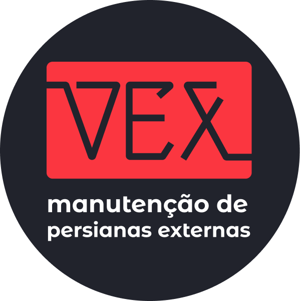
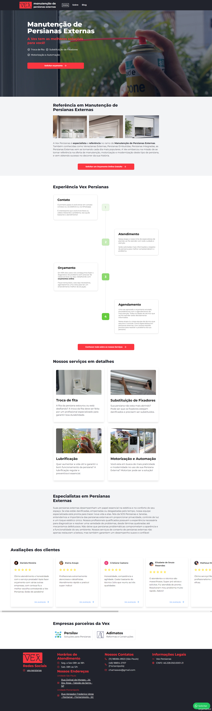

[![LinkedIn][linkedin-shield]][linkedin-url]

<!-- PROJECT LOGO -->
 

  

<h3 align="center">Website - Vex Persianas</h3>

  

    Este projeto tem por objetivo apresentar um pouco do resultado e das tecnologias utilizadas no desenvolvimento do website da Vex Persianas.
     
     
  

<!-- ABOUT THE PROJECT -->
## Sobre o Projeto

O site da Vex Persianas foi desenvolvido com foco em estratégias avançadas de SEO, visando maximizar a visibilidade da empresa nos mecanismos de busca. Utilizando Next.js, o site permite a criação facilitada de múltiplas rotas, otimizadas especificamente para SEO, garantindo que cada página seja indexada de forma eficiente e apareça nos resultados de busca relevantes.

Além disso, integramos a aplicação com o Prismic, um sistema de gerenciamento de conteúdo (CMS) que permite edições ágeis e práticas das postagens no blog da empresa. Com o Prismic, o time de marketing da Vex pode facilmente criar, editar e controlar o conteúdo, sem a necessidade de interagir diretamente com o código, tornando a gestão do blog mais acessível e eficiente.

O site também está integrado ao Google Tag Manager (GTM), permitindo uma gestão mais precisa de tags e scripts, essencial para o acompanhamento de métricas e análise de desempenho das campanhas de marketing. Este website é o destino principal dos anúncios da Vex no Google Ads, funcionando como um ponto de conversão chave para as estratégias de marketing digital da empresa.

(<a href="#readme-top">voltar ao topo</a>)

### Ferramentas e Tecnologias Utilizadas

* [![Next][Next.js]][Next-url]
* [![React][React.js]][React-url]
* [![Prismic][Prismic]][Prismic-url]
* [![Tailwind][Tailwind]][Tailwind-url]

(<a href="#readme-top">voltar ao topo</a>)

## Captura de Tela da Página inicial

    

(<a href="#readme-top">voltar ao topo</a>)

<!-- MARKDOWN LINKS & IMAGES -->
<!-- https://www.markdownguide.org/basic-syntax/#reference-style-links -->
[linkedin-shield]: https://img.shields.io/badge/-LinkedIn-black.svg?style=for-the-badge&logo=linkedin&colorB=555
[linkedin-url]: https://www.linkedin.com/in/leandro-matos-2275521a3/

[Next.js]: https://img.shields.io/badge/next.js-000000?style=for-the-badge&logo=nextdotjs&logoColor=white
[Next-url]: https://nextjs.org/

[React.js]: https://img.shields.io/badge/React-20232A?style=for-the-badge&logo=react&logoColor=61DAFB
[React-url]: https://reactjs.org/

[Prismic]: https://img.shields.io/badge/Prismic-fff?style=for-the-badge&logo=prismic&logoColor=000
[Prismic-url]: https://prismic.io/

[Tailwind]: https://img.shields.io/badge/Tailwind%20CSS-fff?style=for-the-badge&logo=tailwindcss&logoColor=06B6D4
[Tailwind-url]: https://tailwindcss.com/